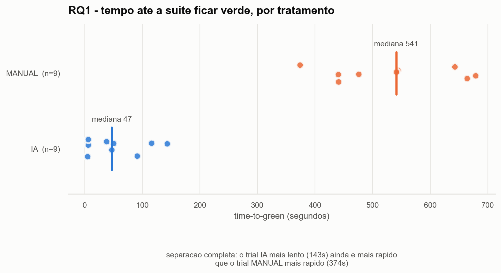
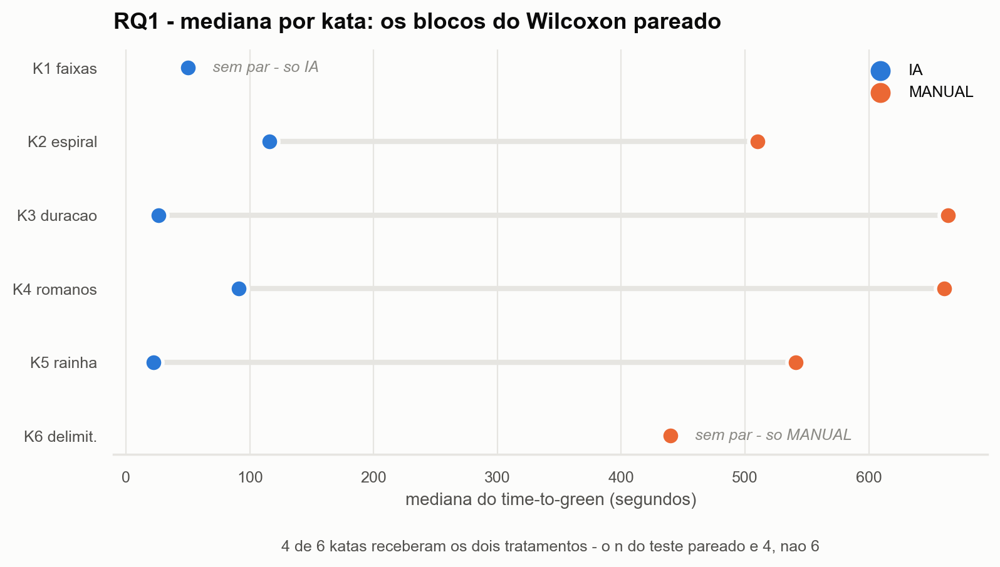
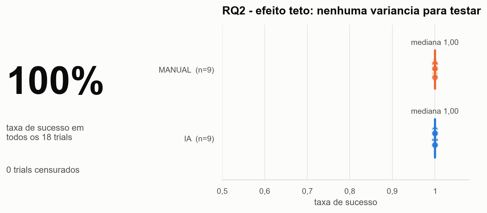
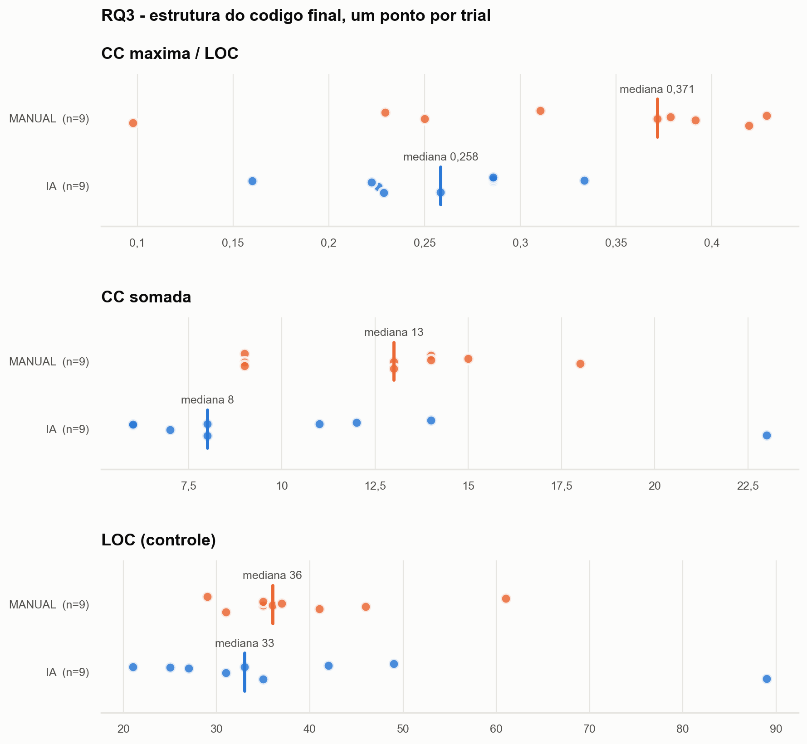
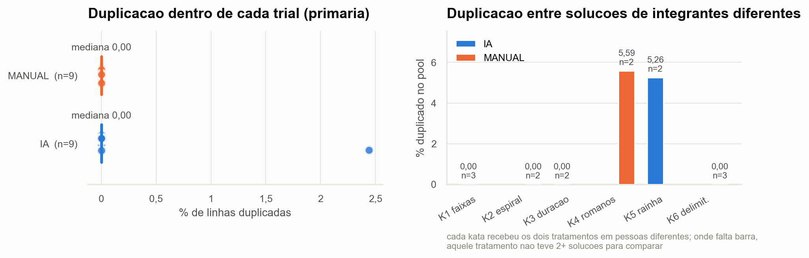
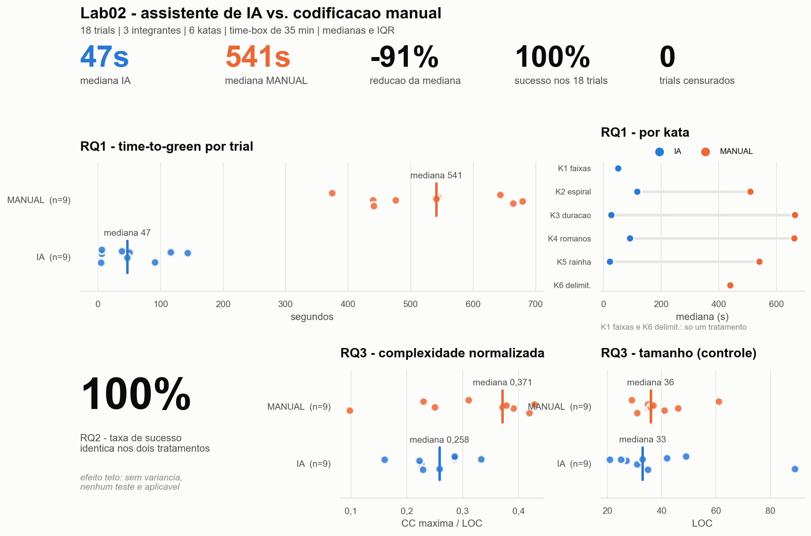

# S03 - Dashboard de visualizacao (Passo 6)

Figuras geradas por `analise/dashboard.py`. Regerar sempre que o dataset mudar -
nenhuma delas e editada a mao.

## RQ1 - tempo por tratamento

## RQ1 - mediana por kata

## RQ2 - taxa de sucesso

## RQ3 - complexidade e LOC

## RQ3 - duplicacao

## Painel consolidado

